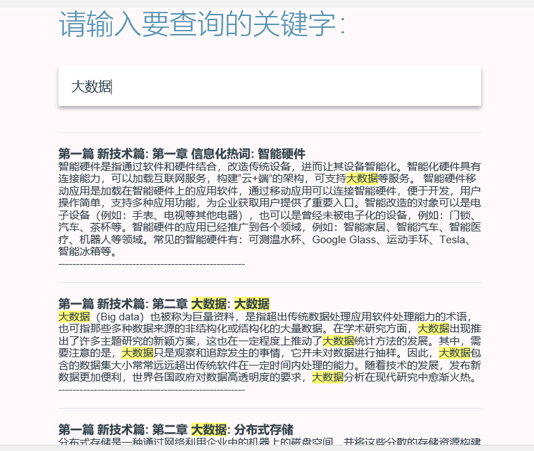

# HotWorld
热词分析平台
<!DOCTYPE html>
<html lang="zh-cn">

   

   
技术：<h3>WebMagic+NLP+HTML+MYsql+JS+词云</h3>

   
分析项目需求，选择相关领域，进行爬虫工作并进行自动摘要、关键字、全文检索等功能设计与实现，最终实现可视化展示.主要运用NLP技术实现文本处理，使用mysql数据库存储。

  <h3>首页：</h3>
  
   <h3>词云页：</h3>
  
   <h3>全文检索：</h3>
  
  <h3>摘要介绍：</h3>
  
  

  
   
   

